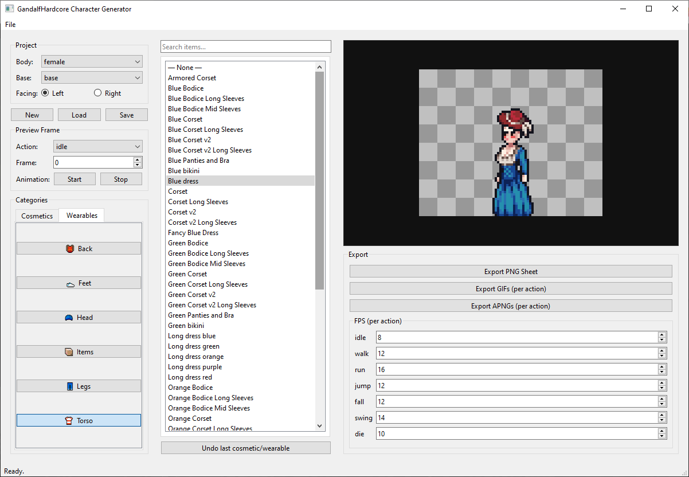

# GandalfHardcore Character Generator
This is a character generator for the **GandalfHardcore 2D pixel art male and female characters** asset pack.
https://gandalfhardcore.itch.io/2d-pixel-art-male-and-female-character

**Please note that this does not come with assets, you must place them in the asset folder.**

READ **"assets_list.txt"** for the list of assets/folders.



GandalfHardcore Character Generator is a Python desktop app (PyQt6) that composes **paperdoll** characters from existing sprite sheets and exports:
- **PNG sprite sheets** (7×10 grid, 80×64 cells)
- **GIF animations** (per action)
- **APNG animations** (per action)

---

## Sprite Sheet Layout (Canonical)

Each sheet is:
- **Rows:** 7
- **Columns:** 10
- **Cell size:** 80×64

Row mapping:
- Row 0: Idle (5 frames used)
- Row 1: Walk (8 frames used)
- Row 2: Run (8 frames used)
- Row 3: Jump (4 frames used)
- Row 4: Fall (4 frames used)
- Row 5: Swing Weapon (6 frames used)
- Row 6: Die (10 frames used)

Unused columns in a row are unused frames; exports keep a full 7×10 grid and leave unused cells transparent.

Wearables/cosmetics use the same layout.

---

## Asset Folder Structure

The app scans the `assets/` folder.

```text
assets/
  schema.json                       (optional)
  bodies/
    <body_id>/
      base.png                      (required, 7x10 left-facing)
      base_right.png                (optional override)
      preview.png                   (optional)
  wearables/
    male_clothing/
    female_clothing/
      back/feet/hands/head/items/legs/torso/
    <slot>/                        (nested structure, optional)
      <item_id>/
        meta.json
        <variant_id>/
          meta.json               (optional variant override)
          <body_id>.png
          <body_id>_right.png
  cosmetics/
    male_cosmetics/
    female_cosmetics/
      ears/eyes/face/facial_hair/hair/hands/jewelry/nose/
        <item>.png or <item>/<variant>.png (with variants)
    <slot>/                        (nested structure, legacy)
      <item_id>/
        meta.json
        <variant_id>/
          <body_id>.png
```

Examples:
- `assets/bodies/male/base.png`
- `assets/wearables/male_clothing/torso/shirt.png`
- `assets/wearables/female_clothing/legs/skirt.png`
- `assets/cosmetics/male_cosmetics/hair/short/black.png`
- `assets/cosmetics/female_cosmetics/hair/short/blonde.png`

### Compatibility
If `<body_id>.png` does **not** exist for an item+variant, that selection is **incompatible** with that body.

---

## Project Files (`.cge`)

Save/load as: `project_name.cge` (JSON stored with a .cge extension)

---

## Running

```bash
python -m venv .venv
.venv\Scripts\activate
pip install -r requirements.txt
```

Run:
```bash
python main.py
```

---

## Export Outputs
Exports are written to the folder you choose in the Export panel.

- PNG sheet: `<project>__<body>__<direction>.png`
- GIFs: `<project>__<body>__<direction>__idle.gif` etc.
- APNGs: `<project>__<body>__<direction>__idle.apng` etc.


## Preview Animation
In the **Preview Frame** panel, use **Start** / **Stop** to play the selected action at the configured FPS.
